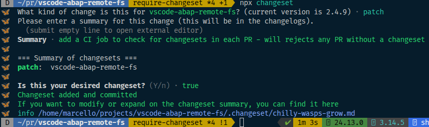

# 贡献指南

你想为 ABAP FS 做贡献？你要么非常勇敢，要么非常迷路。无论如何，欢迎。

## 用 AI 做贡献

说实话——你的 AI 可能会写大部分代码。没关系。但是：

- **把这个文件喂给它。** 说真的。开始之前把整个 CONTRIBUTING.md 粘贴到 AI 的上下文中。这会帮你省下一个被拒绝的 PR
- **你仍然对输出负责。** 审查它生成的内容。检查 diff。不要盲目提交
- **AI 喜欢创建文件。** 留意它丢在工作目录里的随机 `.md` 计划、草稿笔记和“辅助”文件
- **AI 不知道我们的约定。** 它会加分号、用 `require()`、忘记命令类别、跳过文档更新。你需要发现这些

## 开始之前

这个扩展从 2018 年就在发展，功能比大多数人意识到的要多。花一个周末构建东西之前：

- **检查它是否已存在** — 浏览[文档](https://marcellourbani.github.io/vscode_abap_remote_fs)、探索命令面板，或直接问 Copilot “ABAP FS 有做 X 的功能吗？”——它现在比我们更了解这个代码库
- **检查开放的 PR** — 可能有人已经做了一半同样的事。尴尬
- **先开 issue** — “嘿，这个存在吗？应该存在吗？”输入只要 30 秒，可能省你几天
- **如果看起来坏了，可能真的就是坏了** — 不要因为门把手松了就重建房子。报一个 bug

## 入门

1. Fork 仓库并本地克隆
2. `npm install`（这会触发 postinstall，构建 3 个子模块并安装 server + client 的依赖。去喝杯咖啡吧。实际上，泡一整壶）
3. 在 VS Code 中打开仓库文件夹
4. 按 F5 启动扩展开发主机
5. 修改、测试、重复
6. 奇怪自己为什么选了 ABAP 这个职业。坚持下去

## 项目结构

这是 monorepo。模块里套模块。一路都是模块。

```text
client/          → VS Code 扩展（大头）
server/          → 语言服务器（补全、CDS、语法）
modules/
  abapObject/   → ABAP 对象类型定义
  abapfs/       → 虚拟文件系统逻辑
  sharedapi/    → client 与 server 之间共享的类型
```

## 构建

```bash
npm run build          # webpack 打包所有内容（生产）
npm run test           # 跨所有模块运行所有测试
npm run format         # prettier — 提交前运行
```

开发时使用 watch 任务——打开命令面板运行 `Tasks: Run Task`，然后选择 “watch client”。它们会自动链接依赖，所以你不用每碰一个文件就重建整个世界。

### 构建 VSIX 用于测试（Windows）

想全速推进，像真实用户一样安装你的修改？

```bash
build-and-install.bat
```

这会编译所有内容、打包 `.vsix`、安装到 VS Code，让你感觉像个真正的扩展开发者。重新加载窗口后你就在运行自己的构建了。非常有成就感。开 PR 前 10/10 推荐。

## 拉取请求

- 保持 PR 聚焦——每个 PR 一个功能或修复。我们喜欢漂亮的 3 文件 PR。我们害怕 47 文件 PR
- 欢迎测试。没有测试我们不会拒绝 PR，但我们会给你一个眼神
- CI 必须通过。它在 Node 24 上运行。“在我机器上能跑”不是有效的 CI 策略
- 提交信息：就说你做了什么。不要 `feat(scope):` 前缀、不要 🎉 表情、不要俳句
- 推送前运行 `npm run format`——CI 还没强制，但我们能看出来你没跑
- 在项目根目录运行 `npx changeset` 创建一个 [changeset](#changesets) 并回答问题 

### 提交之前

这是大多数 PR 出问题的部分。**真正看看你的 diff。** 每。一。个。文。件。

我们见过被提交的不该提交的东西：

- AI 会话笔记（`session_plan.md`、`implementation_notes.md`、`TODO_AGENT.md`）
- 完整调试日志
- SAP 系统主机名，有时还有密码（是的，真的）
- 只用于一次测试的随机 `.bat` 和 `.ps1` 文件
- `node_modules`（2026 年了！）
- 贡献者自己都不知道存在的文件

如果你用 AI 写代码——说实话，你大概是的——它会产生_大量_临时文件。没关系。只是别提交它们。需要时更新 `.gitignore`。

## 代码风格

- TypeScript 严格模式
- 不用 `any`，除非你有真正好的理由（“这样更简单”不算）
- Prettier 处理格式化（`npm run format`）——构建时不会自动运行，所以自己跑
- 无分号、双引号、关闭尾随逗号——见 `.prettierrc.json`，别跟它较劲
- 100 字符行宽

### 硬性规则

这些会立刻让你的 PR 被拒：

- **无动态导入**（运行时 `import()` / `require()`）。一切必须可静态分析。Webpack 需要打包它，我们需要阅读它。没有例外
- **不调用外部服务** — 这个扩展只与用户的 SAP 系统通信，不去任何其他地方

### 指南

- 优先提前返回而不是深嵌套
- 保持函数短小。需要滚动就拆分
- 错误消息要对用户有帮助，而不是对开发者。“HTTP 401”没用。“认证失败——请在连接管理器中检查你的凭证”有用

### 命令

- 所有命令在 `package.json` 中必须有 `"category": "ABAP FS"`。VS Code 会显示为 `ABAP FS: Do Something`
- 不要在命令标题本身写 “ABAP FS:”——类别会处理。标题只写 `"Do Something"`

### 语言模型工具

- 添加新的 LM 工具时，决定它是否也应通过 MCP 服务器可用。如果是，在工具注册中添加 `abap-fs` 标签
- 只在 VS Code 内有意义的工具（UI 交互、编辑器状态）可以跳过 MCP。查询数据或执行操作的工具通常应该暴露

### 设置

- 添加、移除或更改设置时，更新 `client/media/ABAP-FS-SETTINGS.md`——AI 文档工具用这个文件帮助用户配置扩展
- 设置的描述要让非开发者也能理解。“Enable foo” 太懒。“Automatically start the MCP server when connecting to a SAP system” 才有帮助

### 文档

- 添加或更改功能时更新 `docs/` 文件夹中的相关文件
- **不要直接编辑 `DOCUMENTATION.md`**——它由脚本从 `docs/` 文件夹自动生成。你的修改会被覆盖
- 添加新的文档页面并想包含在 `DOCUMENTATION.md` 中时，把它加到 `docs/_order.yml`
- 想让它出现在 mkdocs 站点导航中时，也加到 `mkdocs.yml`

### Changesets

Changeset 是跟踪变更并按语义化版本维护[变更日志](./CHANGELOG.md)的便捷方式
每个 PR 只需要创建一个，带简短描述和类别：

- patch 用于 bug 修复和小改动，如 AI 工具中的小功能或新命令
- minor 用于较大功能，如一组新的 AI 工具或重写 abapgit 支持（现在能用但基于已弃用的插件）
- major 用于架构变更，如把语言服务器做成可独立用于 [neovim](https://neovim.io/) 的模块

## 我们欢迎的帮助

- 带复现步骤的 bug 报告（SAP 错误截图是点睛之笔）
- 文档改进
- server 模块的测试覆盖率
- CDS 语言支持改进
- Issues 标签中标记 “help wanted” 的任何内容

## 我们不接受的

- 未经讨论的核心破坏性变更
- 增加 500 行却零测试的“改进”
- 明显没经过人工审查的 AI 生成 PR（讽刺，我们知道）

## 有问题？

开 issue 或直接问 Copilot——它确实有理解这个扩展的工具。
