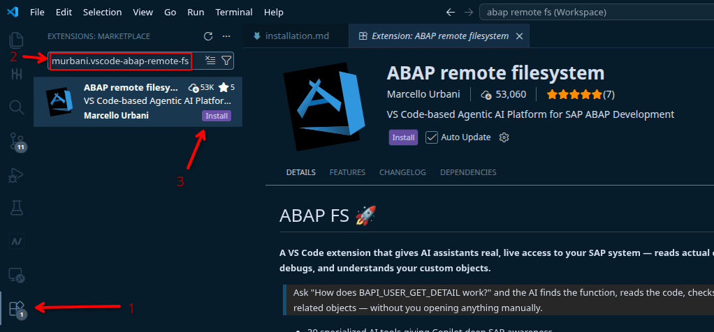

# 安装步骤

在继续之前，请确保满足[前置条件](prerequisite.md)。

> **注意：** ABAP FS 为 Copilot 注册了 40+ 个 AI 工具，但在你连接 SAP 系统之前，只有文档工具可用。先连接 SAP 才能解锁所有工具。

## 1. 安装扩展

1. 按 `Ctrl+Shift+X` 或点击活动栏上的扩展图标，打开**扩展**面板（左侧边栏）
2. 搜索 **murbani.vscode-abap-remote-fs** 或 **ABAP remote filesystem**
3. 点击**安装**，然后重启 VS Code

## 2. 配置 SAP 系统连接

1. 按 `Ctrl+Shift+P` 打开**命令面板**（VS Code 命令搜索栏）
2. 输入并运行：**ABAP FS: Connection Manager**
3. 在连接管理器窗口中，点击**添加 SAP 系统**并填写：
   - **URL** — 你的 SAP 系统 URL
   - **Client**、**Username**、**Language**
   - SAP GUI 设置（可选）
4. 选择连接保存的位置：
   - **用户设置** — 在你所有的 VS Code 工作区中可用
   - **工作区设置** — 仅存储在当前的工程目录中

**提示：**

- 密码存储在操作系统凭据管理器中，而不是设置文件中。
- 如果同事已经配置了连接，请让他们通过**导入/导出**导出并把 JSON 发给你。导出不包含用户 ID 和密码。你可以导入后用**批量操作**批量更新自己的凭证。
- 对于 SAP BTP 系统，使用**云支持**通过 BTP Service Key 或 Endpoint 创建连接。

## 3. 连接 SAP 系统

1. 按 `Ctrl+Shift+P` 并运行：**ABAP FS: Connect to an SAP system**
2. 选择你配置好的系统
3. 提示时输入密码
4. 稍等片刻，等待 VS Code 建立连接

## 密码管理

- **修改密码：** `Ctrl+Shift+P` → **ABAP FS: Change Connection Password** — 选择一个系统并输入新密码。
- **忘记密码：** `Ctrl+Shift+P` → **ABAP FS: Forget connection password** — 删除已存储的密码，下次连接时重新提示。

## 4. 验证连接

- 在**活动栏**（最左侧的垂直图标条）中查找 **ABAP FS** 图标
- 展开视图：**传输**、**Dump**、**ATC 结果**、**跟踪**、**abapGit**
- 测试对象搜索：`Ctrl+Shift+P` → **ABAP FS: Search for object**

## 更新

如果从 VS Code Marketplace 安装且启用了自动更新，扩展会自动更新。检查方法：打开扩展面板（`Ctrl+Shift+X`），找到该扩展，确认**自动更新**已开启。
