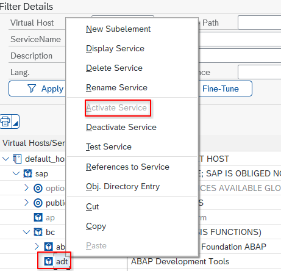

# 前置条件

## Visual Studio Code 或同类编辑器

这是一个 Visual Studio Code 扩展，所以需要一个兼容 VS Code 的编辑器，例如：

- [Visual Studio Code](https://code.visualstudio.com/)
- [VSCodium](https://github.com/VSCodium/vscodium/)
- [SAP Business Application Studio](https://www.sap.com/products/technology-platform/business-application-studio.html)
  ...或者任何其他衍生品，如 Cursor、Windsurf、Kiro、Antigravity……
- 也许也能在 [Theia](https://theia-ide.org/) 上运行，但上次我尝试（一年多前）不行

## 一个可以通过 HTTP 访问的 SAP 系统

你需要能够通过 HTTP 连接你的 SAP 系统，并且在事务 SICF 中激活 ICF 节点 `/sap/bc/adt`：

## GitHub Copilot

AI 功能只有在搭配 [GitHub Copilot](https://github.com/features/copilot/ai-code-editor) 时才能发挥最佳效果。
我们也通过 [MCP 服务器功能](../mcp-server.md) 支持其他 AI 代理，但支持程度不如 Copilot。

## 如果你的系统较旧（比如 ECC 7.51 之前）可能需要插件

写支持需要在开发服务器上安装 [abapfs_extensions 插件](https://github.com/marcellourbani/abapfs_extensions)。浏览和读取功能不需要它。
